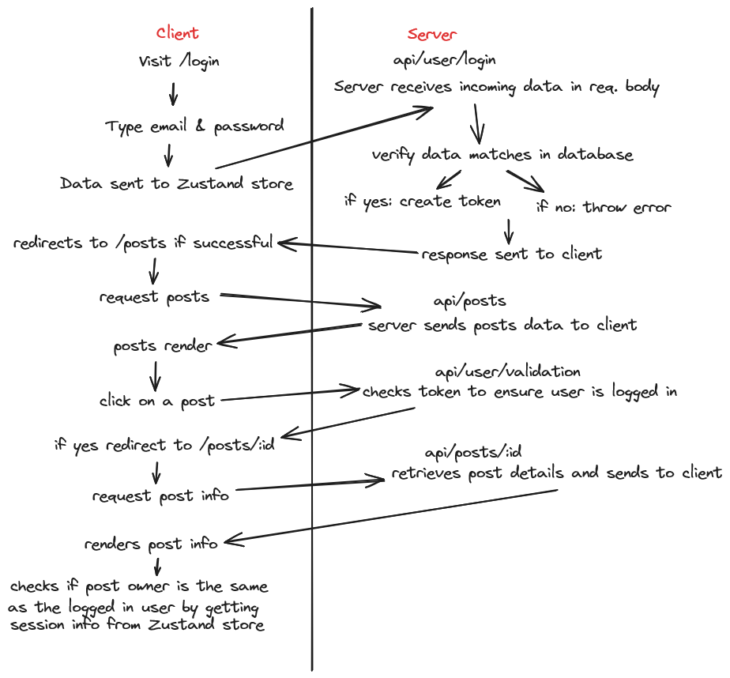

# BCIT COMP 3013 Full Stack React App
This is the full stack React project for BCIT's COMP 3013 Front-Web Development with React

As part of the assignment, I also had to create a flow diagram of the client/server communication during login and visiting the posts page:

